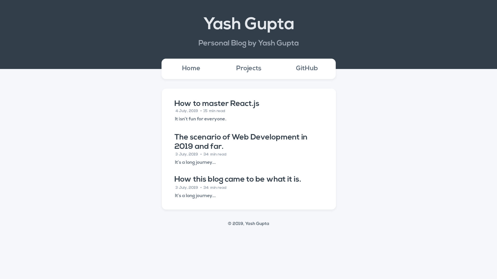

**Disclaimer:** The post might get complicated for non-technical people.

After a few days of putting efforts in to making a blog which I recently aspired to I was able to get it up and running, thanks to the free hosting services of [Netlify](https://www.netlify.com/).

The core language that this blog uses is _javascript_. I love javascript as it can be used in front-end as well as the back-end of my website. Also it was my first programming language just after Basic.

JavaScript on its own isn't enough for making really amazing websites fast enough, although some web apps like Discord use Vanilla JavaScript (Pure JavaScript). But for an individual it is very complicated to make a big app with Vanilla JavaScript.

I decided to use a popular library called React.js, as it is very light-weight, and can get my work done very efficiently. I already had a great experince with React.js of a few months, but React.js alone wasn't enough as my Blog was going to be a static website, It would have been a pain-in-neck to use something that is made for dynamic websites.

That's when I decided to use Gatsby, a static website generator which works with React and also gives my website a blazing fast speed. I also used Graphql which comes built-in with Gatsby for my backend queries.

I decided to stick with _Default-Gatsby-Starter Template_ so that I could explore more of Gatsby.

First of all I removed all of the custom CSS of Gatsby and replaced it with a CSS reset so that I have to do everything from scratch and it would also optimize my website a little bit. I used a self-customized form of [Meyer Web's Reset](https://meyerweb.com/eric/tools/css/reset/).

My `Layout.css` file looks something [like this](https://github.com/yashguptaz/blog/blob/master/src/components/layout.css). (Cannot write it here as it is too big.)

Which was followed by deleting some useless file for this project which came with the boilerplate (by default).

Next I installed some `npm libraries` to this project so that my backend could read static markup.

```bash
npm i --save gatsby-source-filesystem
npm i --save gatsby-transformer-remark
npm i --save gatsby-plugin-catch-links
```

We also need to add some more `npm libraries` and also configure all of them before we can use them in our Blog.

If I'm not wrong we'll have to install the following libraries -

```bash
    npm i --save gatsby-remark-copy-linked-files gatsby-remark-external-links gatsby-remark-images gatsby-remark-prismjs gatsby-remark-reading-time gatsby-remark-responsive-iframe gatsby-source-filesystem
```

Running this command on your command line will install all these libraries although it is something that I did one by one according to my needs. But we will need many of the libraries throughout the making of blog.

Let's configure all these plugins so that we can use them in our project.
It should be done in the file `gatsby-config.js`

```javascript
plugins: [
  `gatsby-plugin-react-helmet`,
  {
    resolve: `gatsby-source-filesystem`,
    options: {
      name: `pages`,
      path: `${__dirname}/src/pages`,
    },
  },
  {
    resolve: `gatsby-transformer-remark`,
    options: {
      plugins: [
        {
          resolve: `gatsby-remark-responsive-iframe`,
          options: {
            maxWidth: 768,
          },
        },
        {
          resolve: `gatsby-remark-prismjs`,
          options: {
            inlineCodeMarker: "÷",
          },
        },
        {
          resolve: `gatsby-remark-images`,
          options: {
            maxWidth: 768,
          },
        },
        {
          resolve: "gatsby-remark-external-links",
          options: {
            target: "_blank",
            rel: "noopener noreferrer",
          },
        },
        "gatsby-remark-copy-linked-files",
        `gatsby-remark-reading-time`,
      ],
    },
  },

  `gatsby-transformer-sharp`,
  `gatsby-plugin-sharp`,
  `gatsby-plugin-catch-links`,
]
```

Make sure you do not repeat any of the commands.

Next I will configure my `gatsby-node.js` to let my static content be put on my backend.

### Creating Markdown file

Let's create our static markdown file which contains our post, you should create this file in the `src/pages` folder only as a convention we make sub-folders having name as date and title of the post _e.g. - 2019-06-06 The-making-of-......_ and then make a markdown file with the name of `index.md` inside it.

Here's how the markdown file for this post looks like -

```markdown
---
path: "/blog/How-this-blog-came-to-be-what-it-is"
date: 2019-06-06
title: "How this blog came to be what it is."
spoiler: "Not for amateurs."
---

**Disclaimer:** The post might get complicated for non-technical people.

After a few days of putting efforts in to making a blog
which I recently aspired to I was able to get it
up and running, thanks to the free hosting
services of [Netlify](https://www.netlify.com/)....
```

### Configuring `gatsby-node.js`

It requires the path method from node.js to get my local files from the server.

```javascript
const path = require("path")
```

Now we need to export the created pages to the reducer. It is important to know `Redux` a tool that Gatsby used under the hood here.

```javascript
exports.createPages = ({ actions, graphql }) => {
  const { createPage } = actions

  const postTemplate = path.resolve("src/templates/blog-post.js")
```

Let us pass the graphql query so that our `Blog Post Template` can get the data and display my posts.

```javascript
return graphql(`
  {
    allMarkdownRemark(sort: { fields: [frontmatter___date], order: DESC }) {
      edges {
        node {
          html
          id
          fields {
            readingTime {
              text
            }
          }
          frontmatter {
            date
            title
            spoiler
            path
          }
        }
      }
    }
  }
`)
```

Let's look at what this query gives us using a tool called graphiql. It can be accessed at this URL while you're running your development build `http://localhost:8000/___graphql`. This is what I got from the tool, this simple shows that our query works.

_Do note I have excluded `HTML` as the result was getting too big._

```javascript
{
  "data": {
    "allMarkdownRemark": {
      "edges": [
        {
          "node": {
            "id": "084e5813-6e48-562b-878b-f4c88df2d3d2",
            "fields": {
              "readingTime": {
                "text": "11 min read"
              }
            },
            "frontmatter": {
              "date": "2019-06-06T00:00:00.000Z",
              "title": "How this blog came to be what it is.",
              "spoiler": "Not for amateurs.",
              "path": "/blog/How-this-blog-came-to-be-what-it-is"
            }
          }
        }
      ]
    }
  }
}
```

Now this query returns a (JavaScript) promise. We will have to iterate through the queries to assign all the posts the right path and the right data.

```javascript
  .then(res => {
    const posts = res.data.allMarkdownRemark.edges

    if (res.errors) {
      return Promise.reject(res.errors)
    }

    posts.forEach(({ node }) => {
      createPage({
        path: node.frontmatter.path,
        component: postTemplate,
      })
    })
  })
}

```

So we use `.then` to check if there are any error in the `res` (result) we are getting. And if there are we reject the Promise.

But if there are no errors we iterate through all the `node(s)` We create a page for every file that is present in the specified path. (The path is specified in the `gatsby-config.js` which we will soon get in to). It uses the component: `postTemplate` which is our `Blog Post Template` to show the data in the specified URL(s).

Now Let's add a next, previous page feature!

```javascript
    posts.forEach(({ node }, index) => {
      createPage({
        path: node.frontmatter.path,
        component: postTemplate,
        context: {
          prev: index === 0 ? null : posts[index - 1].node,
          next: index === posts.length - 1 ? null : posts[index + 1].node,
        },
      })
    })
  })
}
```

For each post we have passed an `index` parameter with the method `forEach`. This assigns a number to every iteration that we go through.

The `createPage` method's object contains another object called `context` that can be passed in our Blog to access the methods inside it.

I have created two methods inside it one for `next` and another for previous (`prev`).

The `prev` methods check if the index or the serial number of the post is `0` which is the 1st post.
Why? Because Zero-based-numbering is often used in Programming [here's a wikipedia article on it.](https://en.wikipedia.org/wiki/Zero-based_numbering)

Now if it is the first post the value of `prev` remains `null` but if it is not then it is not the first post, we get the `node` or an object which has the values of title, date, link etc. for the previous post.

I am not going deep in to the structure of graphql query which explains the `node` thing because it is out of scope of this blog.

Now let's take a loot at this next thing.

```javascript
  next: index === posts.length - 1 ? null : posts[index + 1].node,
```

It checks if the post is the latest post. It does it by subtracting the length of the posts array by 1 as the arrays begin with 0 it gives if we are on the lastest post. For e.g. - if we have _0. A, 1. B, 2. C_ as posts and the program counts them as _1, 2, and 3_ then our latest post is '3 - 1' which is 2 which is also the latest post.

But here's a problem,

```javascript
 allMarkdownRemark(sort: { fields: [frontmatter___date], order: DESC }) {
```

As seen above we are sorting queries in a descending order "`order: DESC`", that would result in next and previous interchanging their places. As out latest is post will be seen as the first post.

There could be a thousand ways to fix this problem but this is how I did it -

```javascript
  next: index === 0 ? null : posts[index - 1].node,
  prev: index === posts.length - 1 ? null : posts[index + 1].node
```

I interchanged the `next` and `prev` keys with each other which fixed the problem.

The reason we are sorting the query in a descending order by Date is so that we can get the latest post on the top by date.

So we are finally done with out `gatsby-node.js` file, the most confusing file.

[This is how it looks now](https://github.com/yashguptaz/blog/blob/master/gatsby-node.js).

### Configuring our Blog Template

I have made seperate `templates` folder in my `src` which contains a file called `blog-post.js`.

This file is a simple functional component and doesn't contain anything much special.

```javascript
import React from "react"
import { graphql } from "gatsby"
import { Link } from "gatsby"
import "../components/global.css"
import PostHeader from "../components/post-header"
import Footer from "../components/footer"
import SEO from "../components/seo"

export default function Template({ data, pageContext }) {
  const post = data.markdownRemark
  const { next, prev } = pageContext
```

Where we are exporting the functional component I'm fetching the posts and `next, prev` from pageContext which I was able to do because I had included that context thing in the `gatsby-node.js` file.

These things aren't being imported in the file from the top but are coming from the bottom of the file as we exported it all over our folder in the `gatsby-node.js` file.

The "`frontmatter: { path: { eq: $path } }`" thing is used to specify the blog's path. The routing is automatically done by Gatsby.

```javascript
export const postQuery = graphql`
  query BlogPostByPath($path: String!) {
    markdownRemark(frontmatter: { path: { eq: $path } }) {
      html
      fields {
        readingTime {
          text
        }
      }
      frontmatter {
        date(formatString: "MMMM DD, YYYY")
        title
        spoiler
        path
      }
    }
  }
`
```

After setting up these queries in your template you can proceed with getting data on your template.

```javascript
export default function Template({ data, pageContext }) {
  const post = data.markdownRemark
  const { next, prev } = pageContext

  return (
    <div>
      <SEO title={post.frontmatter.title} />
      <PostHeader />
      <div
        style={{
          margin: `0 auto`,
          maxWidth: 672,
          padding: `0 0`,
          paddingTop: 0,
        }}
      >
        <div className="blog-template">
          <br />
          <br />
          <h1>{post.frontmatter.title}</h1>
          <small>
            {post.frontmatter.date} • {post.fields.readingTime.text}
          </small>
          <div
            dangerouslySetInnerHTML={{ __html: post.html }}
            className="blog-content"
          />
          <div className="page-btns">
            {prev && <Link to={prev.frontmatter.path}>← Previous Post</Link>}
            {next && <Link to={next.frontmatter.path}>Next Post →</Link>}
          </div>
        </div>
      </div>
      <Footer />
    </div>
  )
}
```

And here we are done with our Blog Template file and if you have had any markdown files in your pages folder, it should all be appearing on the specified paths.

You can easily learn Markdown in 1 hour or so, search for a markdown crash course or a Markdown cheat sheet that you can use to create amazing posts.

### Configuring the `index.js` file or the Homepage

Great! now we have a simple blog, we can go to the url of our blog posts and read them. But wait, isn't it a little bit inconvinient to send everyone a new link everytime a new blog is published.

We need an index file just like the index of books which can help the users reach our posts.

Let's start by importing things that we have to use -

```javascript
import React from "react"

import Layout from "../components/layout"
import SEO from "../components/seo"
import { Link } from "gatsby"
import { graphql } from "gatsby"
import "../components/global.css"
```

We'll use `{ Link }` to link to our blog posts, `{ graphql }` to query from our backend and get the required data, we also have a style sheet of CSS to style our HTML.

Let's see what our functional component looks like.

```javascript
const IndexPage = ({ data }) => (
  <div className="blog-page">
    <Layout>
      <SEO title="A Blog by Yash Gupta" />
      <div className="main-card">
        {data.allMarkdownRemark.edges.map(post => (
          <div key={post.node.id} className="post">
            <Link to={post.node.frontmatter.path}>
              <h3>{post.node.frontmatter.title}</h3>
            </Link>
            <small>
              {post.node.frontmatter.date} •{" "}
              <span className="reading-time">
                {post.node.fields.readingTime.text}
              </span>
            </small>
            <p>{post.node.frontmatter.spoiler}</p>
          </div>
        ))}
      </div>
    </Layout>
  </div>
)
```

We are passing `{ data }` in to this component which comes from a query at the end of this file which I will be showing after I explain this function.

For now see `{data}` as a method which contains all our posts.

Now, in the `div` with the class of `main-card` we start using JavaScript inside of `JSX` by using our curly braces `{}`.

Our edges contains all our posts, we loop through all the edges and from each `post` we take out values like its path to `Link` it to the path of the actual post, its title, date, spoiler etc. and use it with JSX.

Remember our `index.js` file is the first page we see after we open our website.

Let's see the query which gets us all the posts.

```javascript
export const pageQuery = graphql`
  query BlogIndexQuery {
    allMarkdownRemark(sort: { fields: [frontmatter___date], order: DESC }) {
      edges {
        node {
          id
          fields {
            readingTime {
              text
            }
          }
          frontmatter {
            date(formatString: "MMMM DD, YYYY")
            title
            spoiler
            path
          }
        }
      }
    }
  }
`

export default IndexPage
```

Again, I'm not going to explain this query as it is beyond the scope of this post.

## Front-end stuff

This folder is already getting very large and front-end is a wide topic, but I would give a brief description about the front-end of this website.

I'm going to be completely honest, I wasn't able to get the prototype right at the first I had to make some corrections after I practically typed it in to CSS.

But this is what it looked like after I had made with Photoshop.



I decided not to prototype the other web pages as this was a small project.

After prototyping it I typed the whole CSS which was approximately 300 lines of it.

The syntax theme that you see in this blog is copy paste from Sarah Drasner's Night Owl with small tweaks.

If you looked at the interface carefully I made 2 headers using different functional components. Which I imported to `Layout.js` and `blog-post.js` (The template).

Making a good User Interface and User Experince was and is a big part of this project but out of scope of this post.

## Issues, Requests and Suggestions are Welcomed

I don't claim to be a genius in the technologies that I've used while making this blog, it have been a few months since I started learning these technologies. And perhaps, Gatsby is very new to me I stumbled across it just a week ago.

I'm a fan of Open Source, and I have decided to keep this project open source on GitHub.

GitHub has a great mechanism that allows making of `pull requests` around open source project. So if you want to improve this project in any way be sure to open a pull request and make changes in the code, and I'll be sure to merge your changes after a review if they're worthwhile.

If you find any issue with this project and you cannot solve it in code you can also open an issue on GitHub in the repository of this project.

This is the repository of this project
\- https://github.com/yashguptaz/blog

### Expressing Gratitude

Although you won't find any of the part of this project or even any of the post in this blog a victim of plagiarism. I have to thank some people for being an inspiration for this people and some content which helped me learn the underlying technologies with which I was able to make this Blog.

- Dan Abramov's Overreacted.io
- Traversy Media's React's Crash Course
- Traversy Media's JavaScript videos.
- Documentation of Gatsby
- Documentation of React.js
- Documentation of MDN for JavaScript
- W3C School with HTML and CSS
